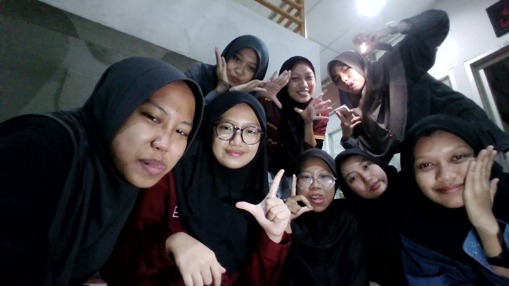

<!DOCTYPE html>
<html lang="id">
<head>
    <meta charset="UTF-8">
    <meta name="viewport" content="width=device-width, initial-scale=1.0">
    <title>Little girl</title>
    
</head>
<body>
    <h1>Littel girl</h1>

    <!-- Menampilkan Gambar -->
    <h2>Gambar</h2>
    
    
Gambar ini adalah anak-anak inkai.

    <!-- Menampilkan Formulir -->
    <h2>Formulir</h2>
    <form action="#" method="POST">
        <label for="name">Nama:</label> 
        <input type="text" id="name" name="name" placeholder="Masukkan nama Anda"> 
        
        <label for="email">Email:</label> 
        <input type="email" id="email" name="email" placeholder="Masukkan email Anda"> 
        
        <label for="message">Pesan:</label> 
        <textarea id="message" name="message" rows="4" cols="50" placeholder="Tulis pesan Anda di sini"></textarea> 
        
        <button type="submit">Kirim</button>
    </form>

    <!-- Menampilkan Tabel -->
    <h2>Tabel</h2>
    <table>
        <thead>
            <tr>
                <th>No</th>
                <th>Nama</th>
                <th>Umur</th>
                <th>Kota</th>
            </tr>
        </thead>
        <tbody>
            <tr>
                <td>1</td>
                <td>Nana</td>
                <td>16</td>
                <td>Jakarta</td>
            </tr>
            <tr>
                <td>2</td>
                <td>Raisa</td>
                <td>13</td>
                <td>Bandung</td>
            </tr>
            <tr>
                <td>3</td>
                <td>Rara</td>
                <td>18</td>
                <td>Kendari</td>
            </tr>
        </tbody>
    </table>
</body>
</html>

